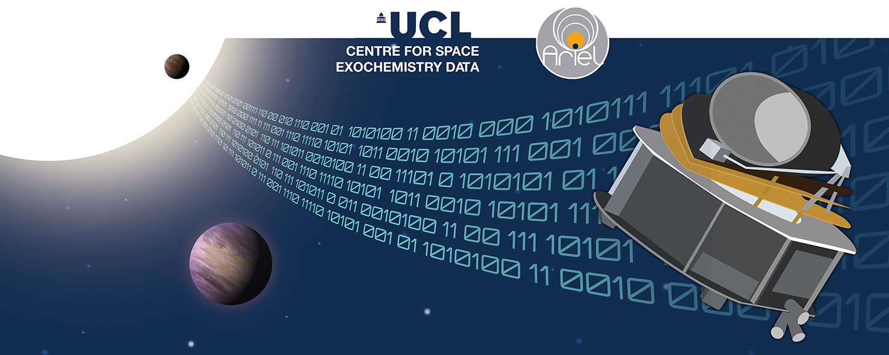
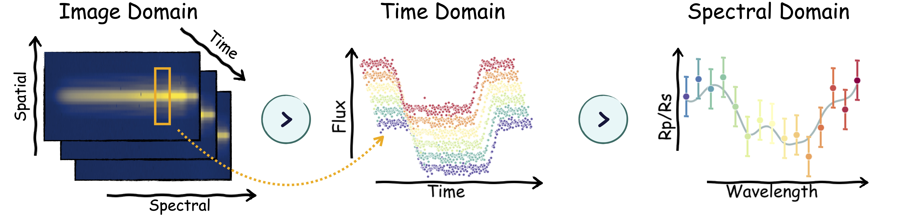

# 概览

你准备好踏上推动天文数据分析极限的旅程了吗？

Ariel 数据挑战赛 2024 邀请你开发机器学习模型，解决该领域中最具挑战性的问题之一——从模拟观测数据中提取微弱的系外行星信号，这些数据来自即将到来的欧洲航天局 Ariel 任务🚀！

## 描述

系外行星的发现——环绕着其他恒星的行星——彻底改变了我们的宇宙观，挑战了我们关于地球独特性和其他地方可能存在生命的传统观念。截至今日，我们已经知道超过 5,600 颗系外行星。检测到这些行星只是第一步；我们还必须通过研究其大气层来理解并表征其性质。在 2029 年，[欧洲航天局的 Ariel 任务](https://arielmission.space/)将对我们银河系邻近区域的 1,000 颗系外行星进行首次全面研究。

观察这些大气层是当代天文学中最困难的数据分析问题之一。当一颗系外行星在我们视线范围内凌日时，只有一小部分恒星光（每百万个光子中有 50–200 个）会穿过行星的大气环并与其化学成分、云层和风相互作用。这些微弱信号的幅度通常在 50ppm（类超级地球）到 200ppm（类木星行星）之间，并且经常被仪器噪声破坏。噪声的一个主要组成部分是航天器在太空中的不可避免的振动，称为“抖动噪声”。这种噪声来自于航天器依靠旋转动量轮保持稳定性时在低重力环境中保持精确指向的困难。类似于用抖动的手拍摄长曝光照片，这种噪声比商业摄影应用中遇到的运动模糊挑战更大。单是抖动噪声引起的光度变化（约200 ppm）就足以与我们希望检测的行星信号相媲美，特别是像地球和超级地球这样的小行星信号。这种噪声再加上其他相关和无关的噪声源，给我们达到 Ariel 载荷设计的严格技术要求带来了很大困难。

本次竞赛的任务是从每次观测中提取大气光谱，并估计其不确定性水平。为了获得这种光谱，我们要求参与者对连续数小时观测系外行星凌日时所拍摄的大量 2D 谱焦平面图像进行去趋势处理。执行这种去趋势处理以从原始观测数据中提取大气光谱及其相关误差条，是任何现代天文仪器在数据进行科学分析之前的关键和常见的预处理步骤。

## 可能的方法

这是一个多模态监督学习任务。参与者可以选择在任一模态（即图像、时间或光谱域）或其组合中去除抖动噪声。每种模态各有其优点。这里我们列出了两种常见的训练策略。

方法 1：直接在完整的 3D 数据立方体上进行训练并提取相应的光谱。这种方法利用了丰富的信息内容，但因此需要大量的计算资源（见上图中的图像到光谱域）。
方法 2：通过沿着像素的 y 轴对每个波长的光通量进行求和，使数据变轻，从而得到维度为 (`$N_{times}$`, `$N_{wavelengths}$`) 的 2D 图像，并对图像进行变换，以增强波长之间的凌日深度变化。
然而，这两种方法都不是去噪抖动时间序列的最佳方法，我们预计获胜的解决方案将包括所有三个域的信息。

## 评估

本次竞赛将使用高斯对数似然函数 (GLL) 来评估不同波长下的预测光谱（`$μ_{user}$`）及其对应的不确定性（`$σ_{user}$`）与真实像素级光谱（y）的比较。

$$
GLL = -\frac{1}{2} \left( \log(2\pi) + \log(\sigma_{user}^2) + \frac{(y - \mu_{user})^2}{\sigma_{user}^2} \right)
$$

每个波长对的 GLL 值将在所有波长上进行求和，并在整个测试集中累加以生成最终的 GLL 值 (L)。最终 GLL 值将通过以下转换函数转换为分数：

$$
score = \frac{L- L_{ref}}{L_{ideal} - L_{ref}}
$$

我们将 `$L_{ideal}$` 定义为提交结果完美匹配真实值且不确定性为每百万 10 个部分 (ppm) 的情况。该理想情况是基于 Ariel 稳定性要求定义的。`$L_{ref}$` 是指使用训练数据集的均值和方差作为预测值的情况。

得分将返回在 [0, 1] 区间内的浮点数，得分越高表示模型性能越好。任何得分低于 0 的将被视为 0。

[完整的指标实现可在此处查看。](https://www.kaggle.com/code/metric/ariel-gaussian-log-likelihood)

## 提交文件

你必须为每个 `planet_id` 预测一个均值和不确定性。数据文件中包含了一个示例提交文件。每个提交行必须包含 567 列，因此我们不打算在这里提供示例。最左列必须是 `planet_id`，接下来的 283 列必须是光谱，剩下的列则为不确定性。

## 时间线

* 2024 年 8 月 1 日 - 开始日期。
* 2024 年 10 月 24 日 - 报名截止日期。你必须在此日期前接受竞赛规则以便参与竞赛。
* 2024 年 10 月 24 日 - 团队合并截止日期。此日期是参与者加入或合并团队的最后一天。
* 2024 年 10 月 31 日 - 最终提交截止日期。

所有截止时间均为相应日期的世界标准时间晚上 11:59，除非另有说明。竞赛组织者保留在认为有必要时更新竞赛时间表的权利。

## NeurIPS 2024

本次竞赛是 [NeurIPS 2024](https://neurips.cc/Conferences/2024) [竞赛轨道](https://blog.neurips.cc/2024/06/04/neurips-2024-competitions-announced/)的一部分。竞赛的前几名将受邀在研讨会上发表演讲。参加研讨会并非参与竞赛的必要条件，但只有出席研讨会的团队才有资格展示其作品。

亲自演讲的与会者需自行承担与参加 [NeurIPS 2024](https://neurips.cc/Conferences/2024) 相关的所有旅行、开支和费用。

与会者还将有机会受邀在 Ariel 联盟会议上展示他们的作品，然而与会者也需自行承担与参加会议相关的所有旅行、开支和费用。

## 奖金

* 第一名 - $15,000
* 第二名 - $10,000
* 第三名 - $8,000
* 第四名 - $7,000
* 第五名 - $5,000
* 第六名 - $5,000

## 代码要求

这是一个代码竞赛。
本次竞赛的提交必须通过笔记本进行。为了在提交后激活 "提交" 按钮，必须满足以下条件：

* CPU 笔记本 ≤ 9 小时运行时间
* GPU 笔记本 ≤ 9 小时运行时间
* 禁用互联网访问
* 允许使用自由和公开可用的外部数据，包括预训练模型
* 提交文件必须命名为 submission.csv
* 提交运行时间会略微混淆。

请参阅代码竞赛常见问题以获取更多关于提交的信息。如遇到提交错误，请查看代码调试文档。

## 致谢

Ariel 数据挑战赛 2024 组织团队：

Dr. Kai Hou Yip (UCL)
Dr. Lorenzo V. Mugnai (Cardiff University & UCL)
Ms. Rebecca L. Coates (UCL)
Dr. Andrea Bocchieri (罗马大学萨皮恩扎)
Dr. Andreas Papageorgiou (卡迪夫大学)
Mr. Orphée Faucoz (CNES)
Ms. Tara Tahseen (UCL)
Dr. Virginie Batista (IAP)
Ms. Angèle Syty (IAP)
Mr. Arun Nambiyath Govindan (UCL)
Dr. In

go P. Waldmann (UCL)

我们感谢以下人士的建议和支持：
Sudeshna Boro Saikia, Quentin Changeat, Pascale Danto, Sohier Dane, Maggie Demkin, Billy Edwards, Paul Eccleston, Clare Jenner, Ryan King, Theresa Lueftinger, Nikolaos Nikolaou, Enzo Pascale, Luís F. Simões 和 Giovanna Tinetti。

Ariel 数据挑战赛 2024 由以下机构创建：

Ariel 数据挑战赛 2024 由以下机构和机构的支持下赞助：

并得到了 Kaggle 竞赛研究计划及以下机构的支持：

## 引用

Kai Hou Yip, Lorenzo V. Mugnai, Rebecca L. Coates, Andrea Bocchieri, Andreas Papageorgiou, Orphée Faucoz, Tara Tahseen, Virginie Batista, Angèle Syty, Arun Nambiyath Govindan, Sohier Dane, Maggie Demkin, Enzo Pascale, Jean-Philippe Beaulieu, Quentin Changeat, Pierre Drossart, Billy Edwards, Paul Eccleston, Clare Jenner, Ryan King, Theresa Lueftinger, Nikolaos Nikolaou, Pascale Danto, Sudeshna Boro Saikia, Luís F. Simões, Giovanna Tinetti, Ingo P. Waldmann (2024). (2024). NeurIPS - Ariel Data Challenge 2024. Kaggle. https://kaggle.com/competitions/ariel-data-challenge-2024. (2024). NeurIPS - Ariel Data Challenge 2024. Kaggle. https://kaggle.com/competitions/ariel-data-challenge-2024